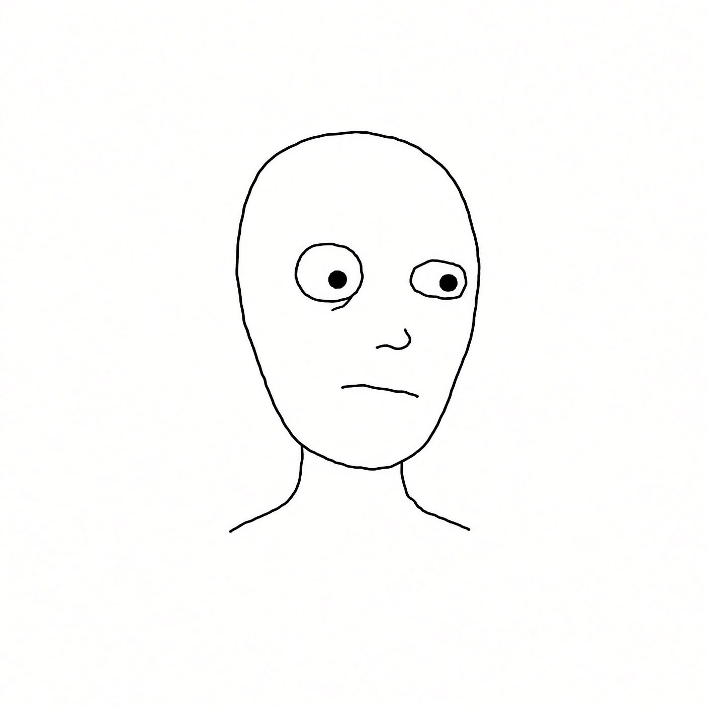

# Base Wogrok DNA

These features are **immutable**. Every trait layer must respect them. If a trait fights the DNA, the trait loses.

## Visual identity

Canonical production file: `layers/base/wogrok_base.png` (1000×1000)

## Locked features

1. **Head shape** — same elongated oval; slightly 3/4-ish frontal
2. **Black line style** — simple continuous outline, same weight as the base
3. **Bald** — no hair, no wigs, no hairline traits
4. **No eyebrows** — ever (eyebrow piercings float above empty brow)
5. **Tiny nose** — two short curved strokes; same placement
6. **Mouth geometry** — short horizontal deadpan line; same width/placement
7. **Left eye (viewer's left)** — flatter / squashed oval
8. **Right eye** — rounder oval
9. **Left pupil** — smaller black dot
10. **Right pupil** — larger black dot
11. **Under-eye bag** — tired crease under the left eye
12. **Facial energy** — blank, exhausted, deadpan — never becomes a different character

## What traits may do

| Category | Allowed | Forbidden |
|---|---|---|
| **Eyes** | Overlays, lids, glasses, pupil *symbols*, effects that sit *on* the existing sockets | Redrawing sockets into symmetric eyes; fixing asymmetry; new eye anatomy |
| **Mouth** | Props from the mouth, facial hair around it, masks over it, teeth/tongue/drool | Replacing the base mouth with a smile/frown/open jaw as a new face |
| **Headwear** | Hats, helmets, horns, halos, bandanas on the skull | Hair, wigs, bangs |
| **Clothing** | Simplified outfits on neck/shoulders/chest | Full-body redesigns that hide the head silhouette or change proportions |
| **Special** | Tattoos, piercings, jewelry, held objects, VFX | Alternate faces or skins that break the line style |

## Recognition test

At **128×128**, you should still see:

- Bald oval head
- Asymmetric eyes (flat left, round right)
- Deadpan mouth
- Tired energy

If you only see "some Wojak with cool traits," the base drifted. Fix the trait, not the DNA.

## Philosophy

> Not "25 different Wojaks."  
> One exhausted Wogrok who has lived 25 completely different crypto lives.
